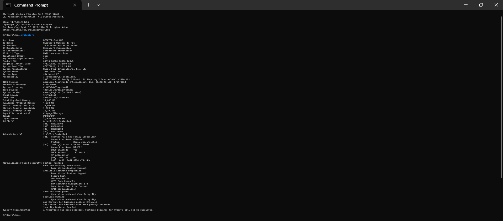
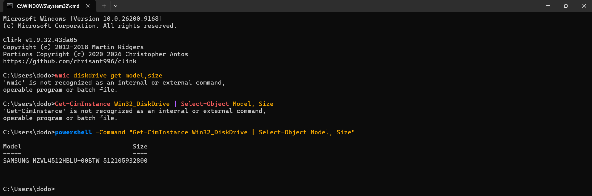
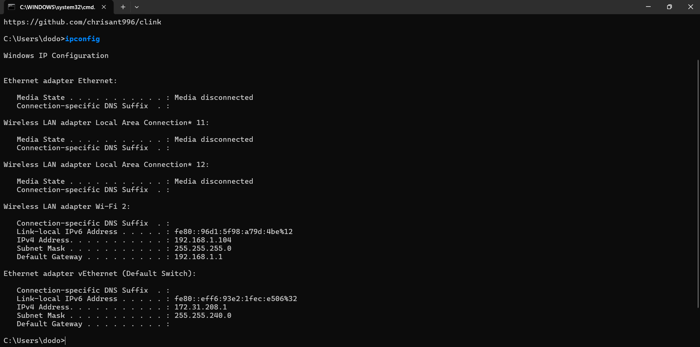

# Computer Hardware Components

*Kaynak:* [IBM: What is Computer Hardware?](https://www.ibm.com/think/topics/hardware)

## 1. Summary (Theory)

### Temel Kavramlar (Core Concepts)
* **CPU (Merkezi İşlem Birimi):** Bilgisayarın beynidir. Tüm hesaplamaları ve yazılımdan gelen talimatları milyarlarca mikroskobik transistör ile inanılmaz hızlarda işler.
* **RAM (Rastgele Erişimli Bellek):** İşlemcinin o an aktif olarak kullandığı verileri geçici olarak tuttuğu çalışma masasıdır. Sistem kapandığında içindeki veriler silinir.
* **Depolama (HDD/SSD):** Verilerin ve işletim sisteminin kalıcı olarak saklandığı arşivdir. SSD'ler hareketli parça içermediği için HDD'lere göre çok daha hızlıdır.
* **Ağ Donanımları (Yönlendirici, Ağ Anahtarı):** Bilgisayarların yerel ağlara ve internete bağlanmasını, cihazlar arası veri iletişimini sağlar.
* **Donanım Sanallaştırması:** Tek bir fiziksel donanım üzerinde "Hipervizör" adı verilen bir yazılım kullanılarak birden fazla sanal bilgisayar (Sanal Makine - VM) çalıştırılması işlemidir. Bulut bilişimin temelidir.

### Siber Güvenlikteki Önemi (Cybersecurity Perspective)
* **CPU:** Zararlı yazılımlar (özellikle Cryptojacking - kripto para madenciliği virüsleri) CPU gücünü sömürür. Ayrıca Meltdown ve Spectre gibi çok kritik zafiyetler doğrudan CPU mimarisini hedefler.
* **RAM:** Adli bilişim uzmanları (Forensics) için bir altın madenidir. Şifreleme anahtarları, parolalar ve o an çalışan zararlı yazılımlar RAM'de bulunur. Sistemi kapatırsanız bu deliller yok olur. "Dosyasız zararlı yazılımlar" (Fileless malware) sadece RAM üzerinde çalışarak antivirüsleri atlatmaya çalışır.
* **Depolama Sürücüleri:** Fidye yazılımları (Ransomware) doğrudan buradaki dosyaları şifreleyerek sistemi kilitler. Silinmiş dosyaların kurtarılması veya işletim sisteminin en alt katmanına gizlenen Rootkit türü zararlıların tespiti için disk yapısı iyi bilinmelidir.
* **Ağ Donanımları:** Bir sisteme dışarıdan sızmak için geçilmesi gereken ilk kapıdır. DDoS (Dağıtılmış Hizmet Aksatma) saldırıları ağ cihazlarını aşırı yüke sokarak çökertmeyi hedefler.
* **Sanallaştırma:** Güvenlik uzmanları zararlı bir dosyayı incelerken kendi bilgisayarlarına bulaşmaması için izole edilmiş Sanal Makineler (Sandbox) kullanırlar. Hackerlar ise bu durumu fark edip sanal makineden ana bilgisayara kaçmayı (VM Escape) hedefler.

## 2. Commands (Cheatsheet)

Aşağıdaki komutları kullanarak sistem donanımlarını analiz edebilirsiniz:

```bash
# Windows: Bilgisayarın donanımı ve işletim sistemi hakkında genel detaylı bir özet sunar.
systeminfo

# Linux: İşlemci (CPU) mimarisi, çekirdek sayısı ve özellikleri hakkında detaylı bilgi verir.
lscpu

# Linux: Sistemdeki toplam, kullanılan ve boşta olan RAM miktarını megabayt cinsinden gösterir.
free -m

# Windows (Eski): Sistemdeki disklerin model ve boyutunu listeler (Yeni Windows sürümlerinde kaldırılmıştır).
wmic diskdrive get model,size

# Windows (Güncel): CMD üzerinden PowerShell çağırarak modern yöntemle disk modelini ve boyutunu getirir.
powershell -Command "Get-CimInstance Win32_DiskDrive | Select-Object Model, Size"

# Windows (PowerShell İçi Alternatif): SSD/HDD gibi fiziksel disk türlerini daha detaylı listeler.
# Not: Bu komutu çalıştırmak için CMD'de 'powershell' yazıp PowerShell terminaline geçmeniz gerekir.
Get-PhysicalDisk

# Linux: Sisteme bağlı olan tüm depolama cihazlarını ve disk bölümlerini (partition) listeler.
lsblk

# Windows: Sistemdeki ağ arayüz kartlarının (NIC) yapılandırmalarını gösterir.
ipconfig

# Linux: Sistemdeki ağ arayüz kartlarının (NIC) yapılandırmalarını gösterir.
ip a
```

## 3. Lab Output (Proof)

### 1. `systeminfo` Çıktısı (Sistem Özeti)


### 2. Disk Bilgisi Çıktısı
*Not: Yeni Windows sürümlerinde `wmic` komutu varsayılan olarak kapalı gelebildiği için PowerShell alternatif komutu kullanılarak başarıyla disk model/boyut bilgisi çekildi.*


### 3. `ipconfig` Çıktısı (Ağ Yapılandırması)

